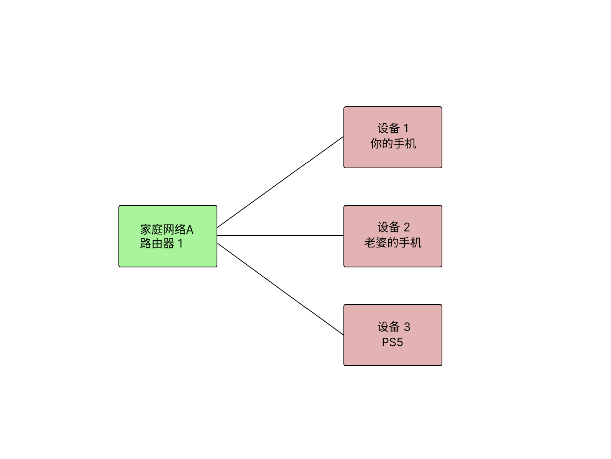
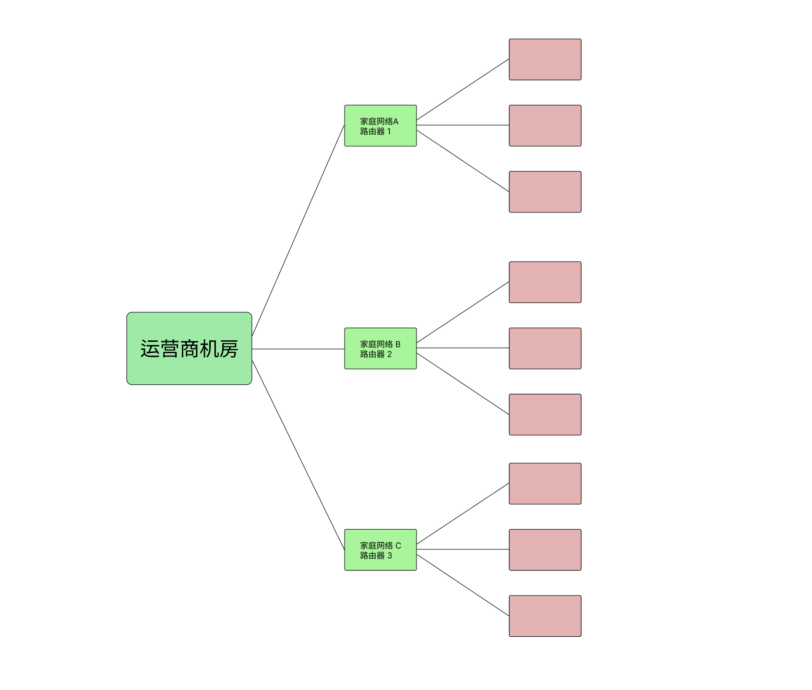

# IPv6 子网

- [IPv6 子网](#ipv6-子网)
  - [子网是什么](#子网是什么)
  - [子网](#子网)
  - [IPv4 与 IPv6 的子网处理方案](#ipv4-与-ipv6-的子网处理方案)
  - [进阶：IPv4 和 IPv6 的子网](#进阶ipv4-和-ipv6-的子网)
    - [IPv4](#ipv4)
      - [子网掩码](#子网掩码)
      - [公网下的子网](#公网下的子网)
      - [家庭或企业下的子网，以及网络地址转换](#家庭或企业下的子网以及网络地址转换)
    - [IPv6](#ipv6)
      - [CIDR（无类别域间路由）](#cidr无类别域间路由)
  - [总结](#总结)
  - [扩展阅读](#扩展阅读)

## 子网是什么
本章节内容会稍微复杂一些，不过我们仍然努力隐藏技术细节，保证普通用户能读懂这些内容。请记住，您不需要了解技术细节。  

在过去的年代，如果您要寄送一封信件（物理）给某人，有时候，信使无法直接将信件寄到收件人手上，因为收件地址可能是在某个单位或企业，信件只能抵达门卫处，然后再由其他人转交给您，或者您自己去取。

这就是子网。

对于互联网，各个设备都是通过物理链路连接的，数据需要通过层层子网进行传输。

## 子网

其实无论是 IPv6 还是 IPv4，网络地址的组成都是基本一样的，其原理都是由大至小，呈现出树形结构。用这两张图来帮助理解。

家庭中的各路设备，通过路由器（WiFi 或者电缆）相互连接到一起，形成一个子网。

然后，各路家庭网络再通过光纤或者电缆，连接到电信运营商在每个临近区域部署的路由器上，再形成一个子网。  

各个电信运营商的路由器，再相互连接，接入到每个省份的省级运营商的路由器上，再形成一个子网。并同时，与其它运营商（电信，联通，移动，balabala）的路由器相互连接，形成互联网。  

圆环套圆环，编织成了现在您正在使用的互联网。

## IPv4 与 IPv6 的子网处理方案
如果某个设备的数据需要发送给另外一个设备，那么必需要知道其目的地，也就是目标 IP 地址。它想要收到目标设备的回信，也需要把自己的 IP 地址带上，这样目标设备才能知道给谁回信。

在 IPv4 时代，由于网络地址的规划长度有限，在电子设备日益增长的时代，没有办法给每个设备都分配一个唯一的地址。这就相当于，您想要在信封上填写收件人的地址时，发现写不满。  

聪明的工程师发明了一种方式，将有限的空间重新组合，使得这有限的 IPv4 地址得以服务于现阶段全球数以亿计的设备。那就是：网络地址转换和子网掩码。  

网络地址转换和子网掩码可以让不具备公网 IP 地址的设备，正常与互联网上的设备通信。即便目标设备也不具备公网 IP 地址。  

不过，即便有这两种技术加持，也无法解决日益增长的设备数量对网络地址的需求。因此 IPv6 的应用总算开始推进了。  

在 IPv6 中，由于充足的网络地址规划，不再需要网络地址转换和子网掩码。

## 进阶：IPv4 和 IPv6 的子网
进阶内容不可避免地使用一些专业术语，可选阅读。  
部分属于在文中如果没有解释，请您自行搜索，对于理解内容来说是必要的。

### IPv4
我们都知道 IPv4 的地址长度是 32位，在 IPv4 互联网结构中，会有一个网关，子网掩码，IP 地址三大要素，一起组成了子网。

#### 子网掩码
子网掩码与 IPv4 地址的长度一样，都是32位（很多初学者会混淆，不知其所以然，以为是 IPv4 地址），需要与 IPv4 地址互相组合使用，单独存在时没有意义。它的用途主要是辅助计算子网范围。  
简单的说就是一个切糕刀子，在 32 位长度的 IPv4 地址中切一刀，左边是网络号（类似于 IPv6 中的前缀），右边就是子网。

#### 公网下的子网
通过子网掩码，有限的地址空间下，被规划成了多个类型的网络，每个类型的网络都通过子网掩码来确定网络的规模（子网数量和主机数量）。   

网络规模越大，主机数量越多，而网络规模越小，主机数量则越少。  

总而言之就是挺复杂的，还是别想太多了。  

#### 家庭或企业下的子网，以及网络地址转换
由于公网 IPv4 地址有限，无法为每一台设备都提供公网 IPv4 地址，但是通信又需要 IPv4 地址，因此互联网地址管理机构将一部分 IPv4 地址划分出来，作为内部网络的专用地址。这可能会减少了一些可用的公网 IPv4 地址，但是通过网络地址转换技术（NAT），可以支持更多的设备接入到互联网。  

比如 ``192.168.1.1/24`` 这个子网。这是家庭常用的子网地址范围。一般路由器作为网关占用了 ``192.168.1.1`` 这个 IP，其余的 IP 分配给了路由器的网关下的设备。这个子网可以支撑 254 个设备接入到网络。

这种方式虽然暂时解决了 IPv4 地址不够用的问题，但是增加了互联网的复杂度，降低了效率，增加了管理成本，属于治标不治本。

### IPv6
有不少用户在初次接触 IPv6 时会有一些不习惯，因为在网络管理配置界面中，您只能看到一个 IPv6 地址（或者还有一个临时 IPv6 地址），没有子网掩码的概念。

这并不是说就没有子网了，该切还是要切，只不过不用子网掩码来切，而是用 ``前缀+子网ID`` 来切。IPv6 切割子网用 ``CIDR`` 格式来表示，比如 ``2001:db8::/32``。大多数情况下，您的家庭网络一般会分到 ``/64`` 或 ``/56`` 的子网（可以去翻一下 README.md 中的那张图，帮助其理解）。这些信息由系统与 IPv6 路由器自动协商管理，您不需要自己去管理。

#### CIDR（无类别域间路由）
CIDR 有一个很好理解的方法。  
比如 ``2001:1db8::/8`` 这个子网，就是从前往后数 ``8`` 个字符（不包括冒号），之后的地址范围都是属于 ``2001:1db8::`` 下的子网。比如 ``2001:1db8::1234`` 是属于 ``2001:1db8::/8`` 这个网络下的 IPv6 地址。

由于子网内的每个设备都有了公网 IPv6 地址，不再需要做网络地址转换，大大降低了管理难度。不需要借助任何额外的手段。

## 总结
简单来说，就是进步和舒适。
在 IPv6 中，很多配置都自动化了，不需要自己管理（对于普通用户来说）。    
IPv6 很好的解决了 IPv4 的诸多问题，子网也能够更好的支持更多的设备，更好的管理互联网。

## 扩展阅读
这篇文档中详细阐述了 IPv6 网络环境，内网中为什么不需要私有网络地址或者网络地址转换。
* [RFC 4864, Local Network Protection for IPv6](https://datatracker.ietf.org/doc/html/rfc4864)  
* [RFC 4864, 中文版（计划中）](#)